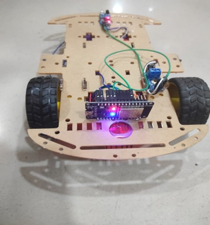
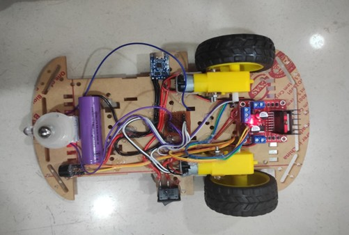
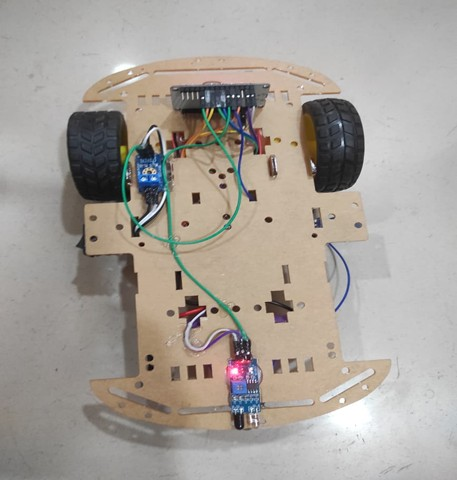
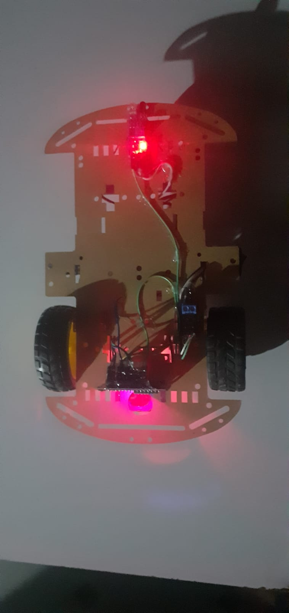
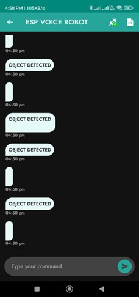

**Voice Controlled IoT Robot** is a smart robotic system that can be controlled using voice commands through the internet. The project uses an ESP32 microcontroller, motor driver, and DC motors to receive commands from a mobile application and perform movements such as forward, backward, left, right, and stop.  By integrating IoT and voice recognition technologies, the robot enables wireless and hands-free control, making it useful for robotics learning, smart automation, and remote operation.  This project demonstrates how modern communication technologies can be used to create intelligent and user-friendly robotic systems.

Developed this Project for learning smart automation and wireless robot control.

##Screenshots

<h2>ESP8266_NodeMCU_microcontroller</h2>

<h2>Underside_of_the_Robot</h2>

<h2>IR_obstacle_detection_sensor</h2>

<h2>Obstacle_Detected</h2>

<h2>ESP_Voice_Robot_mobile_application</h2>

